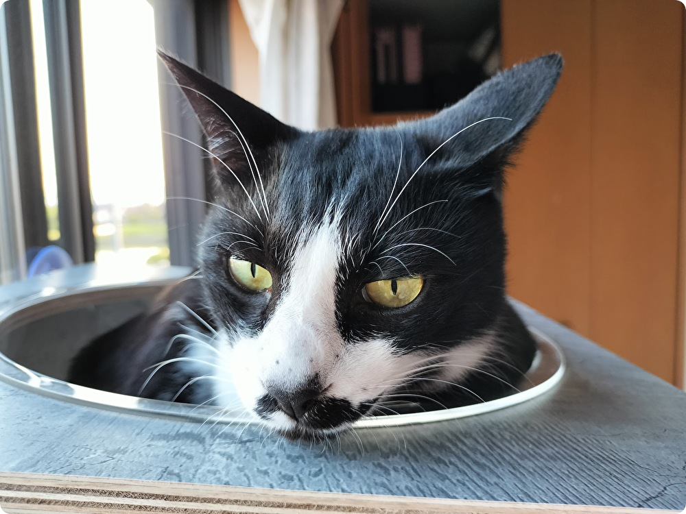

  

  

    A cat lover who works with TypeScript and Scala.
  

  

## Under maintenance
- https://github.com/katayama8000/expo-push-notification-client-rust
- https://github.com/katayama8000/expo-push-notification-api-rust-on-lambda
- https://github.com/katayama8000/terraform-aws
- https://github.com/katayama8000/axum-ddd-rust
- https://github.com/katayama8000/axum-cqrs-rust
- https://github.com/katayama8000/scrapbox-manager
- https://github.com/katayama8000/cosense-client-deno
- https://github.com/katayama8000/honoka-app
- https://github.com/katayama8000/backlog-issue-creator
- https://github.com/katayama8000/backlog-ts
- https://github.com/katayama8000/personal-website
- https://github.com/nulab/backlog-mcp-server

## Output
- https://react-native-meetup.connpass.com/event/325014/
- https://osaki-rs.connpass.com/event/330004/
- https://supporterz-seminar.connpass.com/event/369851/
- https://supporterz-seminar.connpass.com/event/377031/
